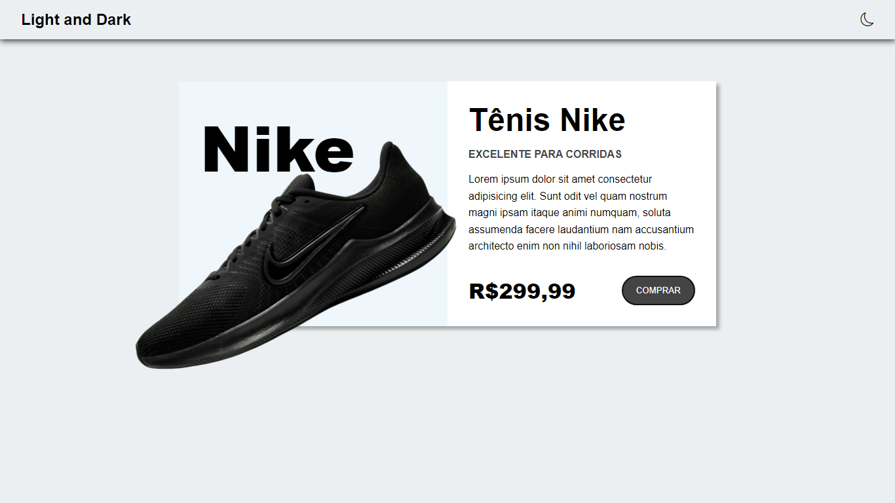
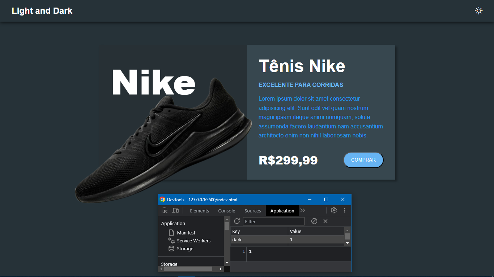

# Projeto light e dark mode

## Projeto inspirado no canal Hora de codar, para estudos a respeito de light e dark mode.
---
## Ideias iniciais:
- Implementar alterações de um tema claro para um tema escuro
- Utilazação de ícones no canto superior para simular o light(sol) e dark(lua)
- Salvar a preferência do usário ao sair da página utilizando localStorage para armazenar esses dados.

---
## Tecnologias Utilizadas:
- HTML
- CSS
- JAVASCRIPT